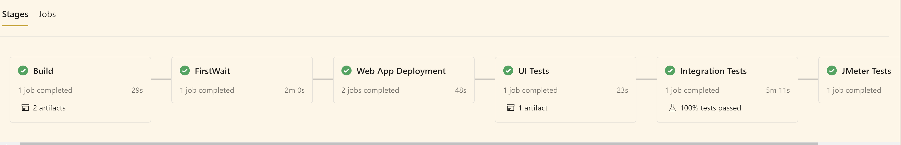

# Udacity-DevOps-Azure-Project-3 - Ensuring Quality Releases

CI / CD Test Automation Pipeline - Azure DevOps - Terraform - JMeter -Selenium - Postman


## Badges

[?branchName=main)](https://dev.azure.com/javiercaparo574/udacity-project-3/_build/latest?definitionId=17&branchName=main)

## Intro

* To use  a variety of industry leading tools, especially Microsoft Azure, to create disposable test environments and run a variety of automated tests with the click of a button.


## Dependencies
| Dependency | Link |
| ------ | ------ |
| Packer | https://www.packer.io/ |
| Terraform | https://www.terraform.io/downloads.html |
| JMeter |  https://jmeter.apache.org/download_jmeter.cgi|
| Postman | https://www.postman.com/downloads/ |
| Python | https://www.python.org/downloads/ |
| Selenium | https://sites.google.com/a/chromium.org/chromedriver/getting-started |
 

## Azure Resources
 - Azure Free account  
 - Azure Storage account (resource)
 - Azure Log Workspace (resource)
 - Terraform Service principle (resource)
 - Azure DevOps Organization ( https://azure.microsoft.com/en-us/services/devops/)
 - Azure CLI (resource)

## Steps

1. Clone this repo:

```sh
git clone https://github.com/jfcb853/Udacity-DevOps-Azure-Project-3
```

2. Open a Terminal in VS Code and connect to your Azure Account and get the Subscription ID

```bash
az login 
az account list --output table
```

3. Configure storage account to Store Terraform state

* Execute the script **azure-storage-account.sh** :

```bash
./azure-storage-account.sh
```

* Take notes of **storage_account_name**, **container_name**, **access_key** . They are will be used in **main.tf** terrafrom files ( lines 15 to 19)

> storage_account_name: tstate3994
> container_name: tstate
> access_key: j/bg+StBWOPqf5fQCPF+tCLFeGURmKEnE675v4aVN1RzyUW3+wlFLrq/dTon4XPrCRKMl5/Z79qNRGR7ZHBPQw==

```bash
  backend "azurerm" {
    storage_account_name = "tstate3994"
    container_name       = "tstate"
    key                  = "terraform.tfstate"
    access_key           = "<access key>"
```

4. Create a  Service Principal with **Contributor** role, performing the following steps:

```bash
az ad sp create-for-rbac --name="UdacityProject3" --role="Contributor" 
```

> Take notes of **appId**, **password**, and **tenant** as will be used at **terraform.tfvars** file 
> (lines 2 to 5)

5. Create a Resource Group for your VM image using Packer and build the Image ( Ubuntu 18.04)

```bash
az group create -n RG-myPackerImage -l eastus2
packer --version
cd packer
packer build ubuntu-image.json
cd..
pwd
```

> Here you will get an Ubuntu 18.04 VM Image that will be used to create the VM.!!! Take note of the following values since you will need  **terraform.tfvars**

```bash
==> azure-arm:  -> Image ResourceGroupName   : 'RG-myPackerImage'
==> azure-arm:  -> Image Name                : 'myPackerImage'
==> azure-arm:  -> Image ID                  : '/subscriptions/<subscription-id>/resourceGroups/RG-myPackerImage/providers/Microsoft.Compute/images/myPackerImage'
==> azure-arm:  -> Image Location            : 'eastus2'
```

6. On your terminal create a SSH key and also perform a keyscan of your github to get the known hosts.

```bash
ssh-keygen -t rsa
cat ~/.ssh/id_rsa.pub
```

```bash
ssh-keyscan github.com
```

7. From the terminal, change into terraform directory

```bash
cd
cd terraform
```

7.1. Copy the **terraform-example.tfvars** as **terraform.tfvars** and fill the parameters marked as `to fill` as indicated with the values from steps  5, 6 and 7.

```bash
cp terraform-example.tfvars terraform.tfvars
nano terraform.tfvars
```

Complete the following parameters:
| parameter| Link |
| ------ | ------ |
| subscription_id | subscription id |
| client_id | service principal client app id |
| client_secret | service principal password |
| tenant_id | service principal tenandt id |
| location | location |
| resource_group | Resource Group |
| application_type | Name of the APP - must be unique |
| virtual_network_name | Name of the VNet |
| packer_image | Packer Image ID  created earlier |
| admin_username | admin username of the VM |
| public_key_path | path of the id_rsa.pub file |

7.2. Don't forget also modify the **main.tf** as was pointed on step 3 !!!

```bash
  backend "azurerm" {
    storage_account_name = "tstate3994"
    container_name       = "tstate"
    key                  = "terraform.tfstate"
    access_key           = "<access key>"
```

8. Login to Azure DevOPs and perform the following settings before to execute the Pipeline. 

8.1. Install these Extensions :

* JMeter (https://marketplace.visualstudio.com/items?itemName=AlexandreGattiker.jmeter-tasks&targetId=625be685-7d04-4b91-8e92-0a3f91f6c3ac&utm_source=vstsproduct&utm_medium=ExtHubManageList)
  
* PublishHTMLReports (https://marketplace.visualstudio.com/items?itemName=LakshayKaushik.PublishHTMLReports&targetId=625be685-7d04-4b91-8e92-0a3f91f6c3ac&utm_source=vstsproduct&utm_medium=ExtHubManageList)

* Terraform (https://marketplace.visualstudio.com/items?itemName=ms-devlabs.custom-terraform-tasks&targetId=625be685-7d04-4b91-8e92-0a3f91f6c3ac&utm_source=vstsproduct&utm_medium=ExtHubManageList)

8.2 Create a Project into your Organization

8.3. Create the Service Connection  in Project Settings > Pipelines > Service Connection

> be sure that you are verified and authenticated here!!!
> get the url to have the Service Connection ID:
(https://dev.azure.com/<organiztion>/<project>/_apis/serviceendpoint/endpoints?api-version=5.0-preview.2)
 
8.4. Add into Pipelines --> Library --> Secure files these 2 files:
the private secure file : **id_rsa key**
the terraform tfvars file : **terraform.tfvars**


8.5. Create a Pipeline --> Environment named "VM-TEST" as is the one used in the pipeline.yaml. Copy the Registration script ( in Linux) since it must be executed on the created VM :

> Something similar to 
```bash
mkdir azagent;cd azagent;curl -fkSL -o vstsagent.tar.gz https://vstsagentpackage.azureedge.net/agent/2.183.1/vsts-agent-linux-x64-2.183.1.tar.gz;tar -zxvf vstsagent.tar.gz; if [ -x "$(command -v systemctl)" ]; then ./config.sh --environment --environmentname "VM-TEST" --acceptteeeula --agent $HOSTNAME .....
```

> Enter the above script into the linux VM created on terraform by ssh and execute it, to get at the end a result like:

```bash
Successfully added the agent
Testing agent connection.
....
   Active: active (running) since Tue 2021-03-09 03:20:16 UTC; 13ms ago
 Main PID: 2330 (runsvc.sh)
    Tasks: 7 (limit: 4680)
   CGroup: /system.slice/vsts.agent.javiercaparo574..ci\x2dcd\x2dtest\x2dautomation.service
           ├─2330 /bin/bash /home/udacity/azagent/runsvc.sh
           └─2333 ./externals/node10/bin/node ./bin/AgentService.js
```

9. Modify the following lines on azure-pipelines.yaml before to update your own repo :

| Line #  | parameter | description |
| ------ | ------ | ------ |
| 13| knownHostsEntry |  the knownHost of your ssh-keyscan github |
| 14 | sshPublicKey |  your public ssh key |
| 66 | azureSubscription | your Pipeline --> Service Connection ID ( step 10.3)  |

> Update your repo to get the new azure-pipelines.yaml file updated

10. Create a New Pipeline in your Azure DevOPs Project

 - Located at GitHub
 - Select your Repository
 - Existing Azure Pipelines YAML file
 - Choosing **azure-pipelines.yaml** file

11. Wait the Pipeline is going to execute on the following Stages:

Build --> FirstWait --> WebApp Deployment --> UI Tests (selenium) -> Integration Tests (postman) --> JMeter -->secondWait 



* Explanation of the Stages

> Provisioning IaC : using Terraform , perform the provisioning of the IaC (RG, VNet, subnet, public IP, App Service, VM Linux).

> Build: Build FakeRestAPI artifact by archiving the entire fakerestapi directory into a zip file and publishing the pipeline artifact to the artifact staging directory , same for Selenium py file.

> Wait: just wait 1minute in case you still did not run the Environment Agent registration script on the created VM ( so still have time to do it)

> Deployments : Deploy FakeRestAPI artifact to the Azure App Service ( created on IaC). The deployed webapp URL is https://jc-test2-appservice.azurewebsites.net where `jc-test2-appservice` is the Azure App Service resource name in small letters. And also deploy Selenium and Chromium to the VM created in IaC

> Integration Tests: Postman Regression and Data Validation tests (using newman/postman) to the APP api created above and publishing the results.

> JMeter TEsts:  JMeter Tests - Endurance & Stress Tests to the APP created above, and publish the results

> UI Tests : Execution of the Selenium Tests an publish its results using the VM-TEST environment.

> WaitforApproval: Manual Intervention to approve the Pipeline and resume it ( 2 hours as maximum)

> DestroyIaC: Destroy the IaC using terraform destroy. Clean up the resources.

12. Create a Log Analytics workspace using this script for simplicity. It will be created on the same RG used by terraform (so if put another name, change the RG in the script!!)

```bash
./deploy_log_analytics_workspace.sh
```
> Go the `WORKSPACE ID` & `WORKSPACE PRIMARY KEY`

* Enter to the VM by ssh and install the OSMAgent.

```bash
wget https://raw.githubusercontent.com/Microsoft/OMS-Agent-for-Linux/master/installer/scripts/onboard_agent.sh && sh onboard_agent.sh -w <YOUR WORKSPACE ID> -s <YOUR WORKSPACE PRIMARY KEY>
sudo /opt/microsoft/omsagent/bin/service_control restart <YOUR WORKSPACE ID>
```

13. Set up email alerts in the App Service:

* In the azure portal go to the app service > Alerts > New Alert Rule. Add an HTTP 404 condition and add a threshold value of 1. This will create an alert if there are two or more consecutive 404 alerts. Click Done. Then create an action group with notification type Email/SMS message/Push/Voice and choose the email option. Set the alert rule name and severity. Wait ten minutes for the alert to take effect. If you then visit the URL of the app service and try to go to a non-existent page more than once it should trigger the email alert.

* Go to the `App service > Diagnostic Settings > + Add Diagnostic Setting`. Tick `AppServiceHTTPLogs` and Send to Log Analytics Workspace created on step above and  `Save`. 

* Go back to the `App service > App Service Logs `. Turn on `Detailed Error Messages` and `Failed Request Tracing` > `Save`. **Restart the app service**.

14. Set up log analytics workspace properly to get logs:

* Go to Virtual Machines and Connect the VM created on Terraform to the Workspace ( Connect). Just wait that shows `Connected`.

* Set up custom logging , in the log analytics workspace go to Advanced Settings > Data > Custom Logs > Add + > Choose File. Select the file selenium.log > Next > Next. Put in the following paths as type Linux:

/var/log/selenium/selenium.log

Give it a name ( `selenium_logs_CL`) and click Done. Tick the box Apply below configuration to my linux machines.

* Go to the App Service web page and navigate on the links and also generate 404 not found , example:

```html
https://jc-test2-appservice.azurewebsites.net

https://jc-test2-appservice.azurewebsites.net/feeeee  ( click this many times so alert will be raised too)
```

Go to Log Analytics Workspace , to run the  following queries:

```kusto
Operation
| where TimeGenerated > ago(2h)
| summarize count() by TimeGenerated, OperationStatus, Detail
```

```kusto
AppServiceHTTPLogs
| where TimeGenerated < ago(2h)
  and ScStatus == '404'
```

```kusto
SELENIUM_LOGS_CL
```

* After some minutes ( 3 to 10 minutes) , check the email configured since an alert message will be received. and also check the Log Analytics Logs , so you can get visualize the logs and analyze with more detail.


## Clean it Up

* on Az DevOps Pipeline , give approval on the notification to resume with the Destroy Terraform Stage.

* and finally run this script to delete the `PackerImage` and `tstate StorageAccount` Resources groups.

```bash
./clean-up-rgs.sh
```

### Useful Links

> Collect custom logs with Log Analytics agent in Azure Monitor (
https://docs.microsoft.com/en-us/azure/azure-monitor/agents/data-sources-custom-logs)

> Collect data from an Azure virtual machine with Azure Monitor (https://docs.microsoft.com/en-us/azure/azure-monitor/vm/quick-collect-azurevm)

> Environment - virtual machine resource (https://docs.microsoft.com/en-us/azure/devops/pipelines/process/environments-virtual-machines?view=azure-devops)

> Build GitHub repositories (https://docs.microsoft.com/en-us/azure/devops/pipelines/repos/github?view=azure-devops&tabs=yaml)

> Tutorial: Store Terraform state in Azure Storage (https://docs.microsoft.com/en-us/azure/developer/terraform/store-state-in-azure-storage)

> Create your first pipeline (https://docs.microsoft.com/en-us/azure/devops/pipelines/create-first-pipeline?view=azure-devops&tabs=azure-cli%2Ctfs-2018-2%2Cbrowser)

> Create a project in Azure DevOps (https://docs.microsoft.com/en-us/azure/devops/organizations/projects/create-project?view=azure-devops&tabs=preview-page)

> Create a Linux VM with infrastructure in Azure using Terraform (https://docs.microsoft.com/en-us/azure/developer/terraform/create-linux-virtual-machine-with-infrastructure)

> Create a Log Analytics workspace with Azure CLI 2.0 (https://docs.microsoft.com/en-us/azure/azure-monitor/logs/quick-create-workspace-cli)

> Hashicorp Terraform with Azure (https://registry.terraform.io/providers/hashicorp/azurerm/latest/docs/resources/subnet)

> azure-pipelines-jmeter-extension (https://marketplace.visualstudio.com/items?itemName=AlexandreGattiker.jmeter-tasks&ssr=false#qna)
(https://github.com/algattik/azure-pipelines-jmeter-extension/issues?utm_source=vsmp&utm_medium=ms%20web&utm_campaign=mpdetails)

> How to troubleshoot issues with the Log Analytics agent for Linux (https://docs.microsoft.com/en-us/azure/azure-monitor/agents/agent-linux-troubleshoot)

## Future Improvements

* Use VMSS in Terraform

## License

---

MIT

**Free Software, Hell Yeah!**
